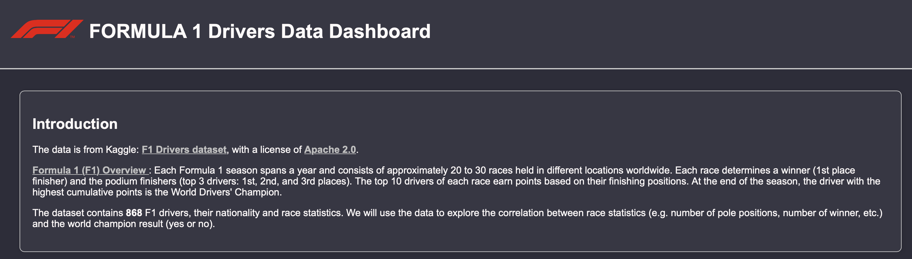
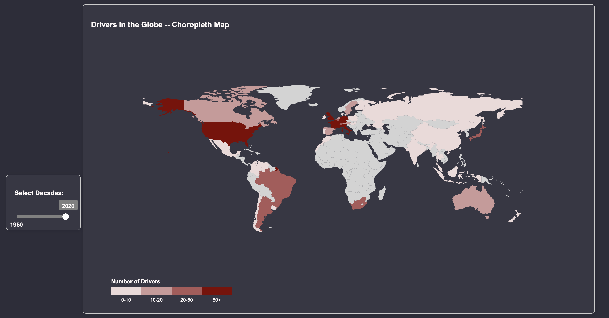
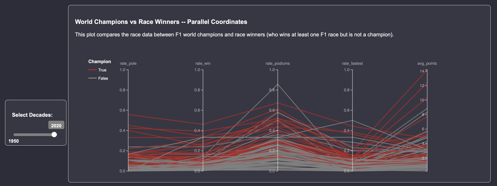
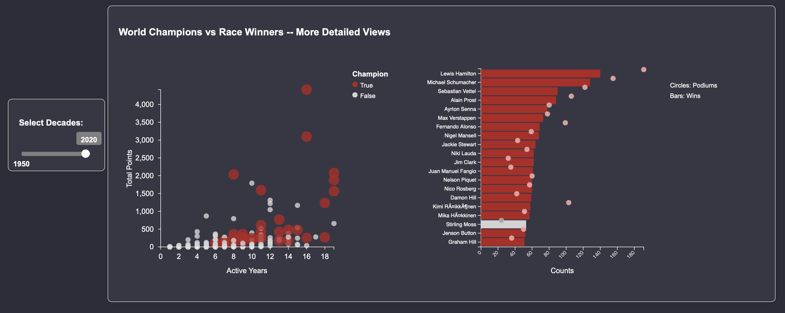

# Formula One Driver Dashboard

## Dataset Reference
The dataset was downloaded from Kaggle: [F1 Drivers dataset](https://www.kaggle.com/datasets/petalme/f1-drivers-dataset/data), with a license of [Apache 2.0](https://www.apache.org/licenses/LICENSE-2.0). <br>

**[Formula 1 (F1) Overview](https://www.formula1.com/en/latest/article/the-beginners-guide-to-the-f1-drivers-championship.53MjXJzTDxQnfxfoCLnxNZ)**: Each Formula 1 season spans a year and consists of approximately 20 to 30 races held in different locations worldwide. Each race determines a winner (1st place finisher) and the podium finishers (top 3 drivers: 1st, 2nd, and 3rd places). The top 10 drivers of each race earn points based on their finishing positions. At the end of the season, the driver with the highest cumulative points is the World Drivers' Champion.<br>

The dataset contains **868** F1 drivers' name (primary key), nationality and race statistics. 

## Visualizations
- Control Panel: Decades (slide bar)
- **Choropleth Map**: Color coded by Number of Drivers in the country
- **Parallel Coordinate Graph**: Color Coded by Yes/No World Champion, with the following coordinates
    - Pole Position Rate
    - Race Winning Rate
    - Podiums Rate
    - Fastest Laps Rate
    - Average Points
- **Scatter Plot:**: Total Points versus Years Active
- **Bar Chart**: Top 20 Drivers winning races and podium places

## Dashboard Overview
To interact with the dashboard, clone the repo and run the following in the terminal:
```
python -m http.server
```
Open a browser and go to "http://localhost:8000/main.html".





